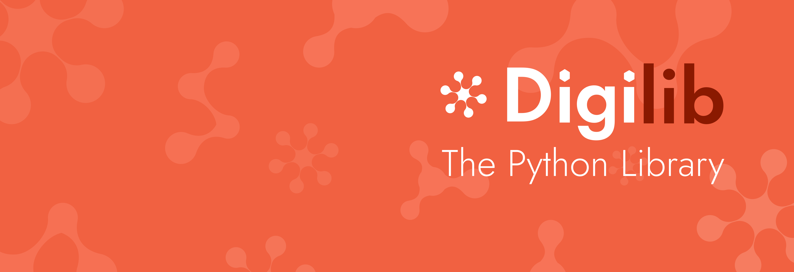

# Digichem-library

Welcome to Digichem: the computational chemistry management suite!

This is Digichem-library, the open-source library for Digichem. If you are looking to build your own computational workflows using the tools that Digichem has to offer, then you have come to the right place.

 - Alternatively, if you are looking for the full Digichem program, try [Build-boy](https://github.com/Chemicus-Ltd/build-boy)
 - If you'd like more information on the Digichem project, check out the [website](https://digi-chem.co.uk)

## Documentation

Please refer to the main Digichem [documentation](https://doc.digi-chem.co.uk) for further reading.

## Dependencies

 - adjustText
 - basis_set_exchange
 - cclib
 - colour-science
 - deepmerge
 - dill
 - matplotlib
 - openprattle
 - periodictable
 - pillow
 - pyyaml
 - rdkit
 - scipy

## Installation

### Pip

Digichem-library can be installed using pip. Simply run the following command:

```Shell
pip install digilib
```

Or, on some platforms:

```Shell
pip3 install digilib
```

## Usage

Documentation coming soon.

## License

Digichem-library is licensed under the BSD-3-Clause license, but some files are licensed separately. See [COPYING.md](COPYING.md) for full details.

The Digichem logo and branding is Copyright Digichem 2025, you may not use them in any way (although you are welcome to look at them).
